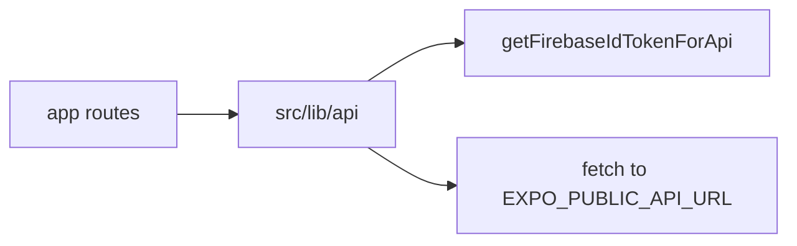

# Architecture

## Stack

- **Expo SDK 54** with **React Native** and **Expo Router** (file-based routing).
- **NativeWind v4** + **Tailwind CSS** for styling (`className` on core React Native components).
- **TypeScript** with path aliases: `@/*`, `@/lib/*`, `@/types`.
- **Jest** + **jest-expo** + **React Native Testing Library** for unit and smoke tests.
- **ESLint** (`eslint-config-expo`) + **Prettier** (`eslint-config-prettier`).

## Data flow

1. Screens call typed helpers in [`src/lib/api/v1.ts`](../src/lib/api/v1.ts) (or `apiRequest` in [`client.ts`](../src/lib/api/client.ts)).
2. `apiRequest` prepends `/api/v1`, sets `Content-Type: application/json` when needed, and adds `Authorization: Bearer <token>` from [`getFirebaseIdTokenForApi`](../src/lib/firebase.ts).
3. The backend validates the token with Firebase Admin and returns JSON shaped like the types in [`types/index.d.ts`](../types/index.d.ts).

## Routing

- **Root** [`app/_layout.tsx`](../app/_layout.tsx): font loading, theme, stack for `(tabs)`, `(auth)`, and `modal`.
- **`(tabs)`** [`app/(tabs)/_layout.tsx`](<../app/(tabs)/_layout.tsx>): bottom tabs — Dashboard (`index`), Calendar, Calculator, Family, Settings.
- **`(auth)`** [`app/(auth)/_layout.tsx`](<../app/(auth)/_layout.tsx>): stack for login and signup placeholders.

Deep links use the scheme from `app.config.ts` (`calorietracker`).

## Configuration

- [`app.config.ts`](../app.config.ts): Expo config, `extra.firebase` placeholders, `extra.mockFirebaseIdToken`, `extra.eas.projectId` from `EAS_PROJECT_ID`.
- [`metro.config.js`](../metro.config.js): `withNativeWind` for CSS/Tailwind processing.
- [`babel.config.js`](../babel.config.js): `babel-preset-expo` + `nativewind/babel`.

## Where to add features

| Change                | Location                                                                                    |
| --------------------- | ------------------------------------------------------------------------------------------- |
| New screen (main app) | `app/(tabs)/your-screen.tsx` and register in `app/(tabs)/_layout.tsx` if it should be a tab |
| New stack screen      | Under `app/` with a `_layout.tsx` group as needed                                           |
| API call              | Add a function in `src/lib/api/v1.ts` using `apiRequest` and types from `@/types`           |
| Business logic        | Prefer `src/lib/utils/` or feature folders under `src/`                                     |
| Styling               | Tailwind classes via `className`; extend theme in `tailwind.config.js`                      |
