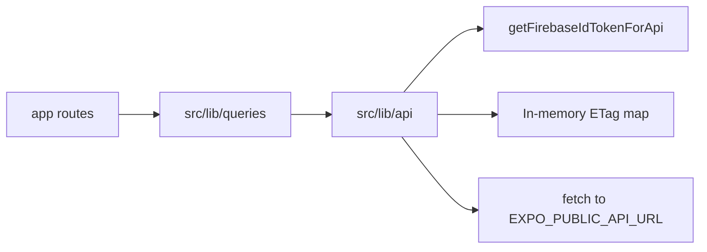

# Architecture

## Stack

- **Expo SDK 54** with **React Native** and **Expo Router** (file-based routing).
- **NativeWind v4** + **Tailwind CSS** for styling (`className` on core React Native components).
- **TypeScript** with path aliases: `@/*`, `@/lib/*`, `@/types`.
- **Jest** + **jest-expo** + **React Native Testing Library** for unit and smoke tests.
- **ESLint** (`eslint-config-expo`) + **Prettier** (`eslint-config-prettier`).

## Data flow

```mermaid
flowchart LR
  Screens[app routes]
  Queries[src/lib/queries]
  Api[src/lib/api]
  ETag[In-memory ETag map]
  Token[getFirebaseIdTokenForApi]
  Http[fetch to EXPO_PUBLIC_API_URL]
  Screens --> Queries
  Queries --> Api
  Api --> Token
  Api --> ETag
  Api --> Http
```

1. Screens and shared components read server state through TanStack Query hooks in [`src/lib/queries/`](../src/lib/queries/) (for example `useMe`, `useEntries`). Mutations update or invalidate the matching query keys.
2. Query hooks call typed helpers in [`src/lib/api/v1.ts`](../src/lib/api/v1.ts) (or `apiRequest` in [`client.ts`](../src/lib/api/client.ts)).
3. `apiRequest` prepends `/api/v1`, sets `Content-Type: application/json` when needed, adds `Authorization: Bearer <token>` from [`getFirebaseIdTokenForApi`](../src/lib/firebase.ts), and for authenticated GETs sends `If-None-Match` / honors `304` via the in-memory ETag map.
4. The backend validates the token with Firebase Admin and returns JSON shaped like the types in [`types/index.d.ts`](../types/index.d.ts).

`QueryClientProvider` wraps the app in [`app/_layout.tsx`](../app/_layout.tsx) inside `AuthProvider`. On sign-out, `queryClient.clear()` and `clearEtagCache()` remove cached data for the previous user.

See [`docs/client-caching-and-revalidation.md`](client-caching-and-revalidation.md) for staleTimes, focus/AppState/pull-to-refresh, and the verification checklist.

## Routing

- **Root** [`app/_layout.tsx`](../app/_layout.tsx): font loading, theme, stack for `(tabs)`, `(auth)`, and `modal`.
- **`(tabs)`** [`app/(tabs)/_layout.tsx`](<../app/(tabs)/_layout.tsx>): bottom tabs — Dashboard (`index`), Calendar, Calculator, Family, Settings.
- **`(auth)`** [`app/(auth)/_layout.tsx`](<../app/(auth)/_layout.tsx>): stack for login and signup placeholders.
- **`(onboarding)`** [`app/(onboarding)/`](<../app/(onboarding)/>): first-run goals calculator (gated when `/me` has no goals/snapshot).

Deep links use the scheme from `app.config.js` (`calorietracker`).

## Configuration

- [`app.config.js`](../app.config.js): Expo config, `extra.firebase` placeholders, `extra.mockFirebaseIdToken`, `extra.eas.projectId` from `EAS_PROJECT_ID`.
- [`metro.config.js`](../metro.config.js): `withNativeWind` for CSS/Tailwind processing.
- [`babel.config.js`](../babel.config.js): `babel-preset-expo` + `nativewind/babel`.

## Related plans

- [Client caching and revalidation](client-caching-and-revalidation.md) — production cache policy (source of truth).
- [Data fetching and caching plan](data-fetching-and-caching-plan.md) — historical TanStack Query adoption plan (Phases 1–2).

## Where to add features

| Change                | Location                                                                                                                                              |
| --------------------- | ----------------------------------------------------------------------------------------------------------------------------------------------------- |
| New screen (main app) | `app/(tabs)/your-screen.tsx` and register in `app/(tabs)/_layout.tsx` if it should be a tab                                                           |
| New stack screen      | Under `app/` with a `_layout.tsx` group as needed                                                                                                     |
| API call              | Add a function in `src/lib/api/v1.ts` using `apiRequest` and types from `@/types`                                                                     |
| Habits / water        | Types in `types/index.d.ts`; UI in Settings + Dashboard; see [`docs/water-and-habits.md`](water-and-habits.md)                                        |
| Calorie calculator    | Backend-owned formulas via `/me/calculator/*`; UI in Calculator tab + onboarding; see [`docs/calculator.md`](calculator.md)                          |
| Saved foods           | API in `src/lib/api/v1.ts`; utils in `src/lib/utils/saved-items.ts`; Settings modal + dashboard combobox; see [`docs/saved-foods.md`](saved-foods.md) |
| In-app feedback       | Settings → `app/feedback.tsx` (+ `feedback-new`, `feedback-detail`); API in `src/lib/api/v1.ts`; see [`docs/feedback.md`](feedback.md)                |
| Business logic        | Prefer `src/lib/utils/` or feature folders under `src/`                                                                                               |
| Styling               | Tailwind classes via `className`; extend theme in `tailwind.config.js`                                                                                |
