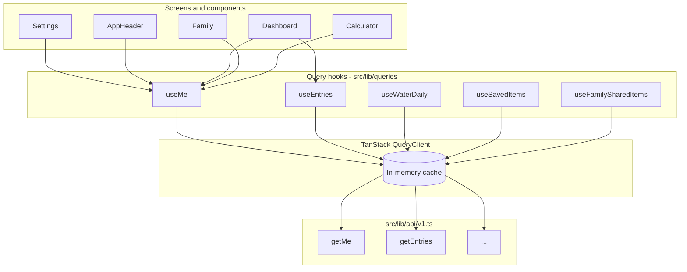

# Data fetching and caching plan

This document defines a formal plan to reduce redundant API traffic, eliminate visible reload flashes (notably the profile photo on Settings), and align the mobile app with industry-standard server-state management.

**Status:** Superseded for day-to-day reference by [`docs/client-caching-and-revalidation.md`](client-caching-and-revalidation.md) (TanStack Query + conditional GET / ETag / 304, focus/AppState/PTR). Keep this file for historical Phases 1–2 context.

**Audience:** Mobile engineers, reviewers, release QA  
**Related:** [`docs/client-caching-and-revalidation.md`](client-caching-and-revalidation.md), [`docs/architecture.md`](architecture.md), [`src/lib/api/client.ts`](../src/lib/api/client.ts), [`components/dashboard/dashboard-context.tsx`](../components/dashboard/dashboard-context.tsx)

---

## Executive summary

The app currently treats most API responses as ephemeral local component state. Multiple screens independently call `getMe()` on mount and on every navigation focus. Returning to the Dashboard triggers a full `refreshAll()` that force-refreshes the Firebase ID token and re-fetches profile data alongside day-scoped entries, water, and exercise.

This produces:

- **High request volume** — many `GET /api/v1/me` calls (observed in backend logs as repeated `GET /` on the user router) per short navigation session.
- **Perceived lazy loading** — UI renders empty or placeholder content until each screen’s private fetch completes.
- **Profile photo flash** — Settings initializes profile state to `null`; the Avatar shows initials until `getMe()` resolves with a signed `downloadUrl`.

**Recommended approach:** adopt **TanStack Query** (`@tanstack/react-query`) as the single server-state layer, centralize profile and other read-mostly data behind shared query hooks, and narrow focus-triggered refetches to data that actually changes frequently (today’s entries, water, exercise).

Estimated effort: **Phase 1 (high impact)** — 2–4 engineering days; **Phase 2 (polish)** — 1–2 days; **Phase 3 (backend/ops, optional)** — 0.5–1 day.

---

## Problem statement

### Observed symptoms

| Symptom | User impact | Backend impact |
| ------- | ----------- | -------------- |
| Profile photo empty briefly on Settings | Looks broken / “lazy loaded” | Extra `GET /me` per visit |
| Many log lines on tab switch | N/A (dev noise) | Repeated handler execution; 304 still hits server |
| Dashboard feels slow when revisiting Home | Spinner / stale-then-update | Full refresh including token force-refresh |
| Duplicate calls on Settings first open | Brief double flash possible | 2× `GET /me` from `useEffect` + `useFocusEffect` |

### Root causes (code-backed)

#### 1. No shared server-state cache

There is no TanStack Query, SWR, or equivalent. Each feature owns its fetch lifecycle via `useState` + `useEffect` / `useFocusEffect`.

`getMe()` is invoked from at least:

| Location | Trigger |
| -------- | ------- |
| [`app/(tabs)/settings.tsx`](../app/(tabs)/settings.tsx) | `useEffect` on `user`; `useFocusEffect` on tab focus; photo refresh callbacks |
| [`components/layout/app-header.tsx`](../components/layout/app-header.tsx) | `useFocusEffect` on tab focus |
| [`components/dashboard/dashboard-context.tsx`](../components/dashboard/dashboard-context.tsx) | `refreshAll()` on mount and Dashboard tab refocus |
| [`app/(tabs)/index.tsx`](../app/(tabs)/index.tsx) | `useFocusEffect` → `refreshAll()` |
| [`app/(tabs)/family.tsx`](../app/(tabs)/family.tsx) | `useEffect` on load |
| [`app/(tabs)/calculator.tsx`](../app/(tabs)/calculator.tsx) | `useEffect` on mount |
| [`components/family/shared-items-list.tsx`](../components/family/shared-items-list.tsx) | Load and refresh paths |
| [`components/settings/habits-settings.tsx`](../components/settings/habits-settings.tsx) | Fallback after patch |
| [`src/lib/notifications/on-authenticated.ts`](../src/lib/notifications/on-authenticated.ts) | Auth startup and app foreground |
| [`src/lib/auth-bootstrap.ts`](../src/lib/auth-bootstrap.ts) | Post sign-in bootstrap |
| [`src/lib/notifications/preference-sync.ts`](../src/lib/notifications/preference-sync.ts) | Preference flush |
| [`components/calendar/calorie-calendar.tsx`](../components/calendar/calorie-calendar.tsx) | Calendar range load |

Parallel callers cannot deduplicate in-flight requests without a shared cache.

#### 2. Aggressive refetch-on-focus

`useFocusEffect` + `getMe()` is an appropriate pattern only when data must always be fresh on every visit. Profile, habits, and calorie goals change infrequently compared to daily log entries.

The Dashboard additionally calls `refreshAll()` on every refocus (after the first), which:

1. Calls `getFirebaseIdTokenForApi({ forceRefresh: true })`.
2. Calls `getMe()` and propagates profile-derived state (`habits`, `familyId`, `calorieGoal`, timezone / `calendarDay`).
3. Fetches entries, saved items, family shared items, exercise, and water in parallel.

Most of that work is unnecessary on a simple tab switch when the user was away for seconds.

#### 3. Profile state starts empty

Settings holds profile in local state initialized to `null`:

```ts
const [profile, setProfile] = useState<GetMeResponse>(null);
```

The [`Avatar`](../components/ui/avatar.tsx) component renders initials or a generic icon until `profilePhoto.downloadUrl` exists. There is no stale-while-revalidate: cached data from a prior visit is not reused if the component remounts or if a refetch clears intermediate state.

#### 4. HTTP cache bypass

[`apiRequest`](../src/lib/api/client.ts) sets `cache: 'reload'` on every fetch (intentionally, to avoid query-string cache-busting issues on strict endpoints like `GET /me/water`). Backend **304 Not Modified** responses therefore still reach the server for validation. Client-side reduction of call *count* matters more than relying on browser HTTP cache.

#### 5. Foreground lifecycle amplification

[`AuthProvider`](../components/auth/auth-provider.tsx) runs `runNotificationStartup` when the app returns to `active`, which calls `getMe()` again for notification settings — overlapping with Dashboard and header fetches.

---

## Goals

1. **Single source of truth** for `GET /me` and other read-mostly API data across tabs and components.
2. **Instant render from cache** when navigating between tabs; background refresh only when data is stale.
3. **Eliminate profile photo flash** on Settings and header when a photo was loaded recently.
4. **Reduce `GET /me` volume** by ≥ 70% during typical tab-switch sessions (measured in dev/staging).
5. **Preserve correctness** after mutations (`patchMe`, photo upload/delete, habits save, saved-item CRUD) via explicit cache invalidation or optimistic updates.
6. **Keep existing API contract** — no backend changes required for Phase 1–2.

## Non-goals

- Replacing Firebase Auth or moving auth tokens into query cache.
- Offline-first sync or persistent SQLite storage (future consideration).
- GraphQL or API redesign.
- Changing backend logging format (Phase 3 optional only).
- Caching mutable day-scoped data beyond short stale windows (entries remain relatively fresh).

---

## Industry standard reference

Modern React Native / Expo applications typically separate concerns as follows:

| Concern | Standard tool | This app today |
| ------- | ------------- | -------------- |
| Auth session | Firebase Auth + context | ✅ `AuthProvider` |
| Server / remote state | **TanStack Query** | ❌ Ad hoc `useState` + fetch |
| Ephemeral UI state | React `useState` / context | ✅ Appropriate |
| Image assets | `expo-image` + disk cache | `Image` + signed URLs |

**TanStack Query** is the de facto choice for REST-backed Expo apps because it provides:

- In-flight request deduplication
- Configurable `staleTime` / `gcTime` (formerly `cacheTime`)
- `placeholderData` / structural sharing to avoid UI flashes
- `invalidateQueries` after mutations
- DevTools (web) and test utilities

Alternatives considered:

| Option | Verdict |
| ------ | ------- |
| **Manual context + TTL map** | Lower dependency cost but reinvents deduplication, invalidation, and loading/error semantics. Acceptable only as a stopgap. |
| **SWR** | Viable; less common in RN monorepos than TanStack Query. |
| **RTK Query** | Better when Redux is already central; this app has no Redux store. |
| **Apollo / urql** | For GraphQL, not applicable. |

**Recommendation:** adopt TanStack Query v5.

---

## Target architecture



### Provider placement

Add `QueryClientProvider` in [`app/_layout.tsx`](../app/_layout.tsx) inside `AuthProvider` so queries can key off `user.uid` and clear on sign-out.

```tsx
// Conceptual — not yet implemented
<AuthProvider>
  <QueryClientProvider client={queryClient}>
    <RootLayoutNav />
  </QueryClientProvider>
</AuthProvider>
```

On sign-out, call `queryClient.clear()` to avoid leaking prior user data.

### Query key convention

Use stable, hierarchical keys:

| Query | Key | Notes |
| ----- | --- | ----- |
| Current user profile | `['me', uid]` | `uid` from Firebase user |
| Entries for a day | `['entries', uid, date]` | `date` = `YYYY-MM-DD` |
| Water for a day | `['water', uid, date]` | |
| Exercise for a day | `['exercise', uid, date]` | |
| Saved items | `['savedItems', uid]` | |
| Family shared items | `['familySharedItems', uid, familyId]` | Disabled when `familyId` null |
| Exercise presets | `['exercisePresets', uid]` | Rarely changes |

### Stale-time policy

| Data | `staleTime` | `gcTime` | Refetch triggers |
| ---- | ----------- | -------- | ---------------- |
| `GET /me` | 5–15 minutes | 30 minutes | `patchMe`, photo upload/delete, pull-to-refresh, sign-in bootstrap |
| Today's entries | 30–60 seconds | 10 minutes | After log/edit/delete entry, Dashboard focus (optional) |
| Water / exercise (day) | 30–60 seconds | 10 minutes | After write, Dashboard focus |
| Saved items | 2–5 minutes | 15 minutes | After saved-item CRUD, invalidate |
| Family shared items | 2–5 minutes | 15 minutes | After share/unshare |
| Exercise presets | 1 hour | 24 hours | Manual refresh only |

**Principle:** data that changes multiple times per day gets short stale times; profile and presets get long stale times.

### Mutation → cache invalidation map

| Mutation | Invalidate |
| -------- | ---------- |
| `patchMe` | `['me', uid]` |
| Profile photo upload / delete | `['me', uid]` |
| `postEntry` / edit / delete entry | `['entries', uid, date]` |
| Water PUT/PATCH | `['water', uid, date]` |
| Exercise write | `['exercise', uid, date]` |
| Saved item CRUD | `['savedItems', uid]`; optionally combobox-related UI |
| Family join / leave | `['me', uid]`, `['familySharedItems', ...]` |

Prefer returning updated entities from mutations and calling `queryClient.setQueryData` when the API already returns the new profile (`patchMe` returns `GetMeResponse`).

---

## Implementation phases

### Phase 1 — Foundation and high-impact fixes

**Objective:** Introduce TanStack Query, centralize `getMe`, remove the worst duplicate fetches.

#### 1.1 Dependencies and provider

- Add `@tanstack/react-query` to `package.json`.
- Create [`src/lib/queries/query-client.ts`](../src/lib/queries/query-client.ts) with default options:
  - `staleTime`: 60_000 (global default; overridden per hook)
  - `retry`: 1 for queries (align with existing error UX)
  - `refetchOnWindowFocus`: `false` for React Native (AppState focus is handled explicitly where needed)
- Wrap root layout with `QueryClientProvider`.
- On auth sign-out, `queryClient.clear()`.

#### 1.2 `useMe` hook

Create [`src/lib/queries/use-me.ts`](../src/lib/queries/use-me.ts):

```ts
export function useMe() {
  const { user } = useAuth();
  return useQuery({
    queryKey: ['me', user?.uid],
    queryFn: getMe,
    enabled: !!user,
    staleTime: 5 * 60_000,
  });
}
```

Export helpers:

- `useMeProfilePhoto()` — derived selector for header/settings Avatar
- `invalidateMe(queryClient, uid)` — shared invalidation util

#### 1.3 Migrate consumers of `getMe()` (read paths)

Replace local `useState` + `useFocusEffect` / `useEffect` fetch patterns:

| File | Change |
| ---- | ------ |
| [`app/(tabs)/settings.tsx`](../app/(tabs)/settings.tsx) | Use `useMe()`; **remove** duplicate `useEffect` + `useFocusEffect` pair; keep form-local state synced from query data via `useEffect` on `data` |
| [`components/layout/app-header.tsx`](../components/layout/app-header.tsx) | Use `useMe()`; remove `useFocusEffect` fetch |
| [`app/(tabs)/family.tsx`](../app/(tabs)/family.tsx) | Derive `familyId` from `useMe()` |
| [`app/(tabs)/calculator.tsx`](../app/(tabs)/calculator.tsx) | Seed defaults from `useMe()` |
| [`components/family/shared-items-list.tsx`](../components/family/shared-items-list.tsx) | Use `useMe()` for sharer profile; avoid redundant fetch |

**Settings profile form:** continue to keep editable field state local (height, weight, age, etc.) but initialize from `me` query data when the modal/section opens or when `me.updatedAt` changes — not from a separate fetch.

#### 1.4 Split Dashboard refresh

Refactor [`components/dashboard/dashboard-context.tsx`](../components/dashboard/dashboard-context.tsx):

| Current `refreshAll` behavior | Proposed |
| ----------------------------- | -------- |
| Force Firebase token refresh | Remove from routine refresh; keep only on 401 retry path in `apiRequest` |
| Always `getMe()` | Read from `useMe()` or `queryClient.fetchQuery` with stale check |
| Fetch entries, water, exercise, saved items | Keep, but expose as separate query hooks or `refreshDayData()` |

Dashboard tab focus ([`app/(tabs)/index.tsx`](../app/(tabs)/index.tsx)):

- Call **`refreshDayData()`** (entries, water, exercise) — not full profile reload.
- Optionally skip refetch if data is still fresh (`staleTime`).

#### 1.5 Consolidate auth startup fetches

- [`src/lib/auth-bootstrap.ts`](../src/lib/auth-bootstrap.ts): after bootstrap patch, invalidate or set `['me', uid]`.
- [`src/lib/notifications/on-authenticated.ts`](../src/lib/notifications/on-authenticated.ts): read notification settings from cached `me` via `queryClient.getQueryData` or prefetch once; avoid unconditional network `getMe()` on every foreground if cache is fresh.

**Acceptance criteria (Phase 1):**

- [ ] Navigating Home → Settings → Home produces at most **one** `GET /me` when cache is fresh (0 if within `staleTime`).
- [ ] Settings Avatar shows cached photo immediately when revisiting within `staleTime`.
- [ ] Dashboard refocus refreshes day data without force token refresh.
- [ ] All existing Jest tests updated; new tests for `useMe` hook.

---

### Phase 2 — UX polish and remaining queries

**Objective:** Extend query coverage; fix image stability; simplify Dashboard context.

#### 2.1 Query hooks for day-scoped and list data

| Hook | Replaces |
| ---- | -------- |
| `useEntries(date)` | Dashboard context entries fetch |
| `useWaterDaily(date)` | Dashboard water fetch |
| `useExercise(date)` | Dashboard exercise fetch |
| `useSavedItems()` | Dashboard saved items fetch |
| `useFamilySharedItems(familyId)` | Dashboard / family shared fetch |

Gradually thin [`DashboardProvider`](../components/dashboard/dashboard-context.tsx) into a coordinator that composes query hooks rather than owning fetch imperatives — or colocate hooks in screens and pass data via context only where truly shared.

#### 2.2 Profile photo stability

Signed `downloadUrl` values may expire before profile metadata changes, causing [`Avatar`](../components/ui/avatar.tsx) `onError` → `getMe()` loops.

Mitigations (pick one or combine):

1. **`expo-image`** with disk caching keyed by stable `profilePhoto.storagePath` or version field.
2. **Persist last known good URL** in AsyncStorage keyed by `uid` + photo version / `updatedAt`.
3. **Backend (optional):** lengthen signed URL TTL for profile photos if currently very short.

Remove unconditional `onRefreshNeeded` → `getMe()` unless error persists after one retry.

#### 2.3 Loading and error UX

- Prefer **skeleton or cached content** over empty placeholders when `isFetching && data` (stale-while-revalidate).
- Centralize query error toasts only for user-initiated actions; background refetch failures can log silently.

#### 2.4 Calendar and exercise presets

- [`components/calendar/calorie-calendar.tsx`](../components/calendar/calorie-calendar.tsx): use `useMe()` for timezone; batch entry queries by visible range with a range key `['entries', uid, start, end]` if API supports it (already has `startDate`/`endDate` query).
- Exercise presets: long `staleTime` query.

**Acceptance criteria (Phase 2):**

- [ ] No visible Avatar flash on Settings after first successful load in session.
- [ ] Dashboard context no longer duplicates query cache state long-term.
- [ ] Saved foods modal invalidates `savedItems` query on CRUD.

---

### Phase 3 — Backend and observability (optional)

**Objective:** Reduce dev log noise and validate improvements.

#### 3.1 Backend logging

- Log **304** responses at `debug` level in development, or sample 1/N requests.
- Add optional `X-Request-Source` header from mobile for tracing (low priority).

#### 3.2 Metrics

- Client: optional Sentry breadcrumb or counter for `getMe` calls per session (behind dev flag).
- Compare before/after request counts using backend access logs for a scripted navigation test.

#### 3.3 HTTP caching (optional, low priority)

Do **not** switch global `cache: 'reload'` without auditing all endpoints. If pursued, use `cache: 'default'` only for safe GETs like `GET /me` and keep `reload` for strict query-string endpoints documented in [`client.ts`](../src/lib/api/client.ts).

---

## File change inventory (expected)

| Action | Path |
| ------ | ---- |
| Add | `src/lib/queries/query-client.ts` |
| Add | `src/lib/queries/use-me.ts` |
| Add | `src/lib/queries/use-entries.ts` (Phase 2) |
| Add | `src/lib/queries/keys.ts` |
| Add | `src/lib/queries/__tests__/use-me.test.tsx` |
| Modify | `app/_layout.tsx` — provider |
| Modify | `app/(tabs)/settings.tsx` |
| Modify | `components/layout/app-header.tsx` |
| Modify | `components/dashboard/dashboard-context.tsx` |
| Modify | `app/(tabs)/index.tsx` |
| Modify | `app/(tabs)/family.tsx` |
| Modify | `app/(tabs)/calculator.tsx` |
| Modify | `components/family/shared-items-list.tsx` |
| Modify | `src/lib/notifications/on-authenticated.ts` |
| Modify | `src/lib/auth-bootstrap.ts` |
| Modify | `docs/architecture.md` — data flow section |
| Modify | `docs/release-test-checklist.md` — add cache regression checks |

---

## Testing strategy

### Unit / integration tests

| Area | Approach |
| ---- | -------- |
| `useMe` | Render hook with `QueryClientProvider` wrapper; mock `getMe`; assert single fetch across double mount with same key |
| Settings | Update [`app/__tests__/settings.test.tsx`](../app/__tests__/settings.test.tsx) to wrap with query client; assert Avatar receives photo without second fetch |
| App header | Update [`components/layout/app-header.test.tsx`](../components/layout/app-header.test.tsx) similarly |
| Dashboard focus | Assert refocus calls day queries only, not `getMe`, when `me` is fresh |
| Sign-out | Assert `queryClient.clear()` removes cached profile |

### Manual QA script

Add to [`docs/release-test-checklist.md`](release-test-checklist.md):

1. Sign in with profile photo set.
2. Open Settings — photo visible **immediately** (no initials flash).
3. Switch tabs: Home → Calendar → Settings → Family → Home (5 cycles).
4. Observe backend logs: `GET /me` count ≤ 2 for the session (initial + optional background stale refresh).
5. Edit profile height → save → verify UI and single invalidation refetch.
6. Upload new profile photo → verify instant update after mutation response.
7. Background app 30s, foreground — notifications still work; no burst of >3 `GET /me`.
8. Sign out → sign in as different user — no stale photo from prior user.

### Regression risks

| Risk | Mitigation |
| ---- | ---------- |
| Stale profile after Settings save | Always `setQueryData` or `invalidateQueries` on `patchMe` response |
| Wrong calendar day after timezone change | Invalidate `me` and day queries when `notifications.timezone` changes |
| Cross-user cache leak | Key all queries with `uid`; `clear()` on sign-out |
| Dashboard totals stale | Keep short `staleTime` on entries/water/exercise |

---

## Rollout plan

| Step | Description |
| ---- | ----------- |
| 1 | Land Phase 1 behind normal PR review; no feature flag required |
| 2 | Dogfood on staging / dev build for one day; compare backend log volume |
| 3 | Land Phase 2 Avatar and dashboard thinning |
| 4 | Update architecture doc and release checklist |
| 5 | Monitor Sentry for new error patterns post-release |

Rollback: TanStack Query is additive; revert PR restores prior fetch behavior. No migration or schema changes.

---

## Success metrics

| Metric | Baseline (estimated) | Target |
| ------ | -------------------- | ------ |
| `GET /me` per 10 tab switches | 8–15 | ≤ 2 |
| Settings photo flash | Every visit | None after first load |
| Dashboard refocus latency | Full `refreshAll` + token refresh | Day queries only; < 300ms cached |
| Duplicate parallel `getMe` on mount | 2–4 | 1 (deduplicated) |

---

## Open questions

1. **Signed URL TTL** — What is the backend TTL for profile photo `downloadUrl`? If < 15 minutes, Phase 2 image caching is required, not optional.
2. **Dashboard context fate** — Fully remove imperative fetches and make context a thin selector over queries, or keep context as orchestrator? Recommendation: thin selector long-term.
3. **Pull-to-refresh** — Should Dashboard expose explicit pull-to-refresh that invalidates day queries + `me`? Recommended yes for user control.
4. **Persist query cache to AsyncStorage** — Defer unless offline support becomes a goal (`@tanstack/react-query-persist-client`).

---

## Decision log

| Date | Decision | Rationale |
| ---- | -------- | --------- |
| 2026-05-26 | Adopt TanStack Query over manual cache | Industry standard; deduplication and invalidation built-in |
| 2026-05-26 | Phase 1 scope: `useMe` + dashboard refresh split | Highest traffic endpoint; fixes reported photo flash |
| 2026-05-26 | Do not change backend for Phase 1 | Client-side fixes sufficient for majority of issue |

---

## References

- [TanStack Query docs — Important Defaults](https://tanstack.com/query/latest/docs/framework/react/guides/important-defaults)
- [TanStack Query docs — Query Keys](https://tanstack.com/query/latest/docs/framework/react/guides/query-keys)
- [Expo — expo-image caching](https://docs.expo.dev/versions/latest/sdk/image/)
- Internal: [`docs/architecture.md`](architecture.md)
